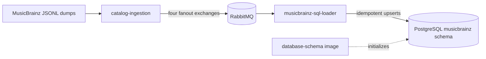

# GrooveMap musicbrainz-sql-loader

`musicbrainz-sql-loader` consumes versioned MusicBrainz catalog events and loads the
complete MusicBrainz dataset into PostgreSQL. It owns the SQL write path for artists,
labels, release groups, releases, relationships, and external links; it does not create
or migrate the database schema.



## Behavior

The loader subscribes to the `artists`, `labels`, `release-groups`, and `releases`
streams under the `groovemap-musicbrainz` exchange prefix. Each record is written in a
single transaction with idempotent `ON CONFLICT` behavior. The separately versioned
[`database-schema`](https://github.com/groovemap-music/database-schema) repository owns
the `musicbrainz` schema definition and initialization image.

`file_complete` messages mark an individual stream complete and schedule its consumer
for cancellation after a configurable grace period. `extraction_complete` is the
terminal signal for the import. A graceful shutdown cancels consumers before closing the
connection, leaving in-flight deliveries unacknowledged so RabbitMQ can redeliver them
once after restart. Completion state is intentionally in memory; after restart the
loader checks durable queues and resumes any remaining work.

See [Import and restart behavior](docs/musicbrainz-sync.md),
[consumer draining](docs/consumer-cancellation.md), and
[completion tracking](docs/file-completion-tracking.md) for operational detail.

## Configuration

PostgreSQL and RabbitMQ credentials are required. Credentials support the Docker
`VAR_FILE=/run/secrets/...` convention; no legacy default credentials are used. The
health endpoint listens on port `8010` and identifies the service as
`musicbrainz-sql-loader`.

See the [configuration reference](docs/configuration.md) for every variable and default.

## Develop and validate

The project uses Python 3.13 or newer and a pinned `groovemap-runtime` revision from
[`python-libraries`](https://github.com/groovemap-music/python-libraries).

```bash
mise install
just setup
just check
```

`just check` is credential-free: PostgreSQL and RabbitMQ boundaries are mocked. It runs
formatting, linting, contract verification, secret scans, typing, unit and regression
tests, wheel build/install checks, license checks, and a version-bump preview. In
particular, it preserves shutdown-delivery, drain, completion, and transient-failure
regressions.

Build the repository-named local image separately when Docker is available:

```bash
just image
# produces musicbrainz-sql-loader:local
```

The [`deployment`](https://github.com/groovemap-music/deployment) repository owns the
multi-service Compose stack. This repository owns only the service image and its
credential-free checks.

## Compatibility identifiers

The public service, executable, health identity, log identity, and container image all
use `musicbrainz-sql-loader`. Two older identifiers remain deliberately:

- `brainztableinator` is the Python import package. Renaming it would break installed
  callers and serialized import paths.
- `brainztableinator` is also the durable AMQP consumer suffix. Changing it would create
  a new queue set and could strand messages in existing queues.

New integrations should use the `musicbrainz-sql-loader` executable and service name;
the compatibility identifiers are implementation details.

## Contracts, release, and license

- Catalog-event contract v1 is promoted byte-for-byte from `catalog-ingestion`.
- Persistence compatibility v1 is promoted from `database-schema`.
- `just source-check` verifies promoted files and the generated binding by SHA-256.
- `just release-dry-run` validates release artifacts without tagging, pushing,
  publishing, or releasing.

The current tree is MIT licensed. Historical revisions retain their then-applicable
license.

Start with the [documentation index](docs/README.md) for additional local detail.
