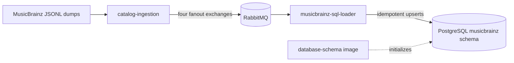

# GrooveMap musicbrainz-sql-loader

`musicbrainz-sql-loader` consumes versioned MusicBrainz catalog events and loads the
complete MusicBrainz dataset into PostgreSQL. It owns the SQL write path for artists,
labels, release groups, releases, relationships, and external links; it does not create
or migrate the database schema.



## Behavior

The loader subscribes to the `artists`, `labels`, `release-groups`, and `releases`
streams under the `groovemap-musicbrainz` exchange prefix. Each record is written in a
single transaction with idempotent `ON CONFLICT` behavior. The separately versioned
[`database-schema`](https://github.com/groovemap-music/database-schema) repository owns
the `musicbrainz` schema definition and initialization image.

`file_complete` messages mark an individual stream complete and schedule its consumer
for cancellation after a configurable grace period. `extraction_complete` is the
terminal signal for the import. A graceful shutdown cancels consumers before closing the
connection, leaving in-flight deliveries unacknowledged so RabbitMQ can redeliver them
once after restart. Completion state is intentionally in memory; after restart the
loader checks durable queues and resumes any remaining work.

See [Import and restart behavior](docs/musicbrainz-sync.md),
[consumer draining](docs/consumer-cancellation.md), and
[completion tracking](docs/file-completion-tracking.md) for operational detail.

## Configuration

PostgreSQL and RabbitMQ credentials are required. Credentials support the Docker
`VAR_FILE=/run/secrets/...` convention; no legacy default credentials are used. The
health endpoint listens on port `8010` and identifies the service as
`musicbrainz-sql-loader`.

See the [configuration reference](docs/configuration.md) for every variable and default.

## Telemetry

The loader pushes OpenTelemetry metrics **and traces** over **OTLP/HTTP-protobuf** to the
collector. There is no gRPC transport and no Prometheus scrape endpoint; the JSON `/health`
endpoint on port `8010` is unchanged. Only standard OTEL environment variables are read,
and there are no GrooveMap-specific telemetry variables.

| Variable | Effect |
| --- | --- |
| `OTEL_EXPORTER_OTLP_ENDPOINT` | Collector base URL, e.g. `http://otel-collector:4318`. **Unset disables both signals.** |
| `OTEL_EXPORTER_OTLP_METRICS_ENDPOINT` | Per-signal override of the base URL for metrics. |
| `OTEL_EXPORTER_OTLP_TRACES_ENDPOINT` | Per-signal override of the base URL for spans. |
| `OTEL_METRICS_EXPORTER` | `otlp` (default) or `none` to disable metric export. |
| `OTEL_TRACES_EXPORTER` | `otlp` (default) or `none` to disable span export. |
| `OTEL_TRACES_SAMPLER` | Sampler name; defaults to `parentbased_traceidratio`. |
| `OTEL_TRACES_SAMPLER_ARG` | Sampling ratio, 0.0–1.0. Compose sets 1.0 in dev and 0.1 in the prod overlay. |
| `OTEL_METRIC_EXPORT_INTERVAL` | Export period in milliseconds; the SDK default is 60000. |
| `OTEL_SERVICE_NAME` | `service.name`; defaults to the AMQP consumer identity `brainztableinator`. |
| `OTEL_RESOURCE_ATTRIBUTES` | Extra resource attributes, e.g. `service.namespace=groovemap,deployment.environment.name=dev`. |

The two signals are independent: a deployment can keep the process view while turning span
volume off with `OTEL_TRACES_EXPORTER=none`. Telemetry never fails startup — with no endpoint
configured the bootstrap logs once and installs no-op providers, and the loader behaves
exactly as it did before telemetry existed. Both providers are force-flushed and shut down on
exit so the last export lands.

The `source` attribute on every domain metric is the constant `musicbrainz`, and `entity` is
the singular canonical entity type (`artist`, `label`, `release-group`, `release`).

| Instrument | Kind | Attributes |
| --- | --- | --- |
| `groovemap.pipeline.messages` | counter | `source`, `entity`, `outcome` |
| `groovemap.pipeline.message.duration` | histogram (`s`) | `source`, `entity` |
| `groovemap.pipeline.batch.size` | histogram (`{items}`) | `store`, `entity`, `outcome` |
| `groovemap.pipeline.batch.flush.duration` | histogram (`s`) | `store`, `entity`, `outcome` |
| `groovemap.pipeline.consumers.active` | up-down counter | `source` |
| `messaging.client.consumed.messages` | counter | `messaging.system`, `messaging.destination.name`, `messaging.operation.name`, `error.type` on failure |
| `messaging.client.operation.duration` | histogram (`s`) | same as above |
| `db.client.operation.duration` | histogram (`s`) | `db.system.name`, `db.operation.name`, `error.type` on failure |
| `groovemap.pipeline.reconnects` | counter | `system` |
| `groovemap.pipeline.circuit_breaker.state` | observable gauge | `system` |

The last three come from the `groovemap-runtime` resilience wrappers the loader already
uses; nothing in this repository records them.

Runtime instruments are installed by `setup_telemetry` from the `otel` extra and are
observable, so the SDK reads them on the exporter's own thread and nothing on the message
path pays for them. `process.open_file_descriptor.count` is absent on Windows and the
`cpython.gc.*` instruments are absent on PyPy — the series is missing rather than a
misleading zero.

| Instrument | Kind | Attributes |
| --- | --- | --- |
| `process.cpu.time` | observable counter (`s`) | `type` (`user`, `system`) |
| `process.cpu.utilization` | observable gauge (ratio) | — |
| `process.memory.usage` | observable up-down counter (`By`) | — |
| `process.memory.virtual` | observable up-down counter (`By`) | — |
| `process.thread.count` | observable up-down counter | — |
| `process.open_file_descriptor.count` | observable up-down counter | — |
| `process.context_switches` | observable counter | `type` (`involuntary`, `voluntary`) |
| `cpython.gc.collections` | observable counter | `generation`, `cpython.gc.generation` |
| `groovemap.runtime.event_loop.lag` | histogram (`s`) | — |

`groovemap.runtime.event_loop.lag` is sampled once a second by a background task the loader
starts from its own running event loop right after `setup_telemetry`; `shutdown_telemetry`
cancels it.

Spans use low-cardinality names built only from the closed sets the metric attributes already
use. No mbid, statement, file name, or free text reaches a span name or attribute, and a
failure sets status `ERROR` with `error.type` only — never a message, a stack trace, or a
span event carrying a payload.

| Span | Kind | Attributes |
| --- | --- | --- |
| `process {queue}` | consumer | `messaging.system`, `messaging.destination.name`, `messaging.operation.name`, `outcome`, `error.type` on failure |
| `session postgresql` | client | `db.system.name`, `db.operation.name`, `error.type` on failure |
| `flush postgresql {entity}` | internal | `db.system.name`, `groovemap.entity`, `outcome`, `error.type` on failure |

`process {queue}` is opened from the `traceparent` header the extractor's publish left on the
message, so a record's whole path — dump file, publish, this loader, PostgreSQL — is one
trace. A delivery whose headers carry no readable trace context starts a new trace rather
than failing. The loader acks and nacks its own aio-pika deliveries instead of going through
`common.process_message_with_retry`, so it opens this span itself from the shared helpers,
with the identical name, kind, and attributes the wrapper would have used.

`flush postgresql {entity}` covers one `executemany` of relationship or external-link rows
and carries a span link to each delivery whose rows it writes; `common.flush_span` caps that
at 64 links. One delivery drives one flush here, so in practice there is a single link. The
flush runs inside `session postgresql` rather than around it, because the handler checks a
connection out of the pool before the per-entity write — the tree reads
`process {queue}` → `session postgresql` → `flush postgresql {entity}`.

Span metrics (call counts and durations per span name) are derived by the collector's
`spanmetrics` connector, never emitted here.

## Develop and validate

The project uses Python 3.14 and a pinned `groovemap-runtime` revision from
[`python-libraries`](https://github.com/groovemap-music/python-libraries).

```bash
mise install
just setup
just check
```

`just check` is credential-free: PostgreSQL and RabbitMQ boundaries are mocked. It runs
formatting, linting, contract verification, secret scans, typing, unit and regression
tests, wheel build/install checks, license checks, and a version-bump preview. In
particular, it preserves shutdown-delivery, drain, completion, and transient-failure
regressions.

Build the repository-named local image separately when Docker is available:

```bash
just image
# produces musicbrainz-sql-loader:local
```

The [`deployment`](https://github.com/groovemap-music/deployment) repository owns the
multi-service Compose stack. This repository owns only the service image and its
credential-free checks.

## Compatibility identifiers

The public service, executable, health identity, log identity, and container image all
use `musicbrainz-sql-loader`. Two older identifiers remain deliberately:

- `brainztableinator` is the Python import package. Renaming it would break installed
  callers and serialized import paths.
- `brainztableinator` is also the durable AMQP consumer suffix. Changing it would create
  a new queue set and could strand messages in existing queues.

New integrations should use the `musicbrainz-sql-loader` executable and service name;
the compatibility identifiers are implementation details.

## Contracts, release, and license

- Catalog-event contract v1 is promoted byte-for-byte from `catalog-ingestion`.
- Persistence compatibility v1 is promoted from `database-schema`.
- `just source-check` verifies promoted files and the generated binding by SHA-256.
- `just release-dry-run` validates release artifacts without tagging, pushing,
  publishing, or releasing.
- [Release compliance](docs/release-compliance.md) describes the security, dependency,
  history, and remote-approval boundaries for publication.

The current tree is MIT licensed. Historical revisions retain their then-applicable
license.

Start with the [documentation index](docs/README.md) for additional local detail.
