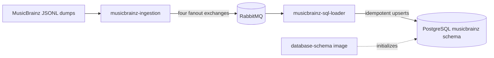

# GrooveMap musicbrainz-sql-loader

`musicbrainz-sql-loader` consumes versioned MusicBrainz catalog events and loads the
complete MusicBrainz dataset into PostgreSQL. It owns the SQL write path for artists,
labels, release groups, releases, relationships, and external links; it does not create
or migrate the database schema.



## Behavior

The loader subscribes to the `artists`, `labels`, `release-groups`, and `releases`
streams produced by
[`musicbrainz-ingestion`](https://github.com/groovemap-music/musicbrainz-ingestion). The
promoted contract names exchanges `groovemap-musicbrainz-{entity}`. This loader's durable
queues are `groovemap-musicbrainz-brainztableinator-{entity}` with `.dlx` and `.dlq`
dead-letter suffixes; the `brainztableinator` segment is a compatibility identifier.

Each record is written in a single transaction with idempotent `ON CONFLICT` behavior to
`musicbrainz.artists`, `musicbrainz.labels`, `musicbrainz.release_groups`,
`musicbrainz.releases`, `musicbrainz.relationships`, and
`musicbrainz.external_links`. The separately versioned
[`database-schema`](https://github.com/groovemap-music/database-schema) repository owns
the `musicbrainz` schema definition and initialization image.

Each of the four entity upserts also writes `gm_item_id`, the native catalog identifier. A
record naming its Discogs counterpart attaches to that item's existing id rather than minting
a parallel one; everything else mints its own. See
[Native catalog identity](docs/musicbrainz-sync.md#native-catalog-identity).

Both `file_complete` and `extraction_complete` mark the receiving stream complete and
schedule its consumer for cancellation after a configurable grace period. The producer
publishes the version-level `extraction_complete` signal to all four exchanges. A graceful
shutdown cancels subscriptions before closing the connection; a delivery that reaches the
shutdown guard is left unsettled so RabbitMQ can redeliver it once after restart. Completion
state is intentionally in memory, while records and queues remain durable.

See [Import and restart behavior](docs/musicbrainz-sync.md),
[consumer draining](docs/consumer-cancellation.md), and
[completion tracking](docs/file-completion-tracking.md) for operational detail.

## Configuration

PostgreSQL and RabbitMQ credentials are required. Credentials support the Docker
`VAR_FILE=/run/secrets/...` convention; no legacy default credentials are used. The
health endpoint listens on port `8010` and identifies the service as
`musicbrainz-sql-loader`.

See the [configuration reference](docs/configuration.md) for every variable and default.

## Telemetry

The loader pushes OpenTelemetry metrics **and traces** over **OTLP/HTTP-protobuf** to the
collector. There is no gRPC transport and no Prometheus scrape endpoint; the JSON `/health`
endpoint on port `8010` is unchanged. Only standard OTEL environment variables are read,
and there are no GrooveMap-specific telemetry variables.

| Variable | Effect |
| --- | --- |
| `OTEL_EXPORTER_OTLP_ENDPOINT` | Collector base URL, e.g. `http://otel-collector:4318`. **Unset disables both signals.** |
| `OTEL_EXPORTER_OTLP_METRICS_ENDPOINT` | Per-signal override of the base URL for metrics. |
| `OTEL_EXPORTER_OTLP_TRACES_ENDPOINT` | Per-signal override of the base URL for spans. |
| `OTEL_METRICS_EXPORTER` | `otlp` (default) or `none` to disable metric export. |
| `OTEL_TRACES_EXPORTER` | `otlp` (default) or `none` to disable span export. |
| `OTEL_TRACES_SAMPLER` | Sampler name; defaults to `parentbased_traceidratio`. |
| `OTEL_TRACES_SAMPLER_ARG` | Sampling ratio, 0.0–1.0. Compose sets 1.0 in dev and 0.1 in the prod overlay. |
| `OTEL_METRIC_EXPORT_INTERVAL` | Export period in milliseconds; the SDK default is 60000. |
| `OTEL_SERVICE_NAME` | `service.name`; defaults to the AMQP consumer identity `brainztableinator`. |
| `OTEL_RESOURCE_ATTRIBUTES` | Extra resource attributes, e.g. `service.namespace=groovemap,deployment.environment.name=dev`. |

The two signals are independent: a deployment can keep the process view while turning span
volume off with `OTEL_TRACES_EXPORTER=none`. Telemetry never fails startup — with no endpoint
configured the bootstrap logs once and installs no-op providers, and the loader behaves
exactly as it did before telemetry existed. Both providers are force-flushed and shut down on
exit so the last export lands.

The `source` attribute on every domain metric is the constant `musicbrainz`, and `entity` is
the singular canonical entity type (`artist`, `label`, `release-group`, `release`).

| Instrument | Kind | Attributes |
| --- | --- | --- |
| `groovemap.pipeline.messages` | counter | `source`, `entity`, `outcome` |
| `groovemap.pipeline.message.duration` | histogram (`s`) | `source`, `entity` |
| `groovemap.pipeline.batch.size` | histogram (`{items}`) | `store`, `entity`, `outcome` |
| `groovemap.pipeline.batch.flush.duration` | histogram (`s`) | `store`, `entity`, `outcome` |
| `groovemap.pipeline.consumers.active` | up-down counter | `source` |
| `messaging.client.consumed.messages` | counter | `messaging.system`, `messaging.destination.name`, `messaging.operation.name`, `error.type` on failure |
| `messaging.client.operation.duration` | histogram (`s`) | same as above |
| `db.client.operation.duration` | histogram (`s`) | `db.system.name`, `db.operation.name`, `error.type` on failure |
| `groovemap.pipeline.reconnects` | counter | `system` |
| `groovemap.pipeline.circuit_breaker.state` | observable gauge | `system` |

`db.client.operation.duration`, `groovemap.pipeline.reconnects`, and
`groovemap.pipeline.circuit_breaker.state` come from the `groovemap-runtime` adapters rather
than this repository. The shared package also owns the `process.*`, `cpython.gc.*`, and
`groovemap.runtime.event_loop.lag` definitions and their platform availability; see its
[telemetry boundary](https://github.com/groovemap-music/python-libraries/blob/main/docs/runtime.md#telemetry-boundary)
for the authoritative inventory. This loader starts the event-loop monitor after telemetry
setup and stops it through `shutdown_telemetry`.

Spans use low-cardinality names built only from the closed sets the metric attributes already
use. No mbid, statement, file name, or free text reaches a span name or attribute, and a
failure sets status `ERROR` with `error.type` only — never a message, a stack trace, or a
span event carrying a payload.

| Span | Kind | Attributes |
| --- | --- | --- |
| `process {queue}` | consumer | `messaging.system`, `messaging.destination.name`, `messaging.operation.name`, `outcome`, `error.type` on failure |
| `session postgresql` | client | `db.system.name`, `db.operation.name`, `error.type` on failure |
| `flush postgresql {entity}` | internal | `db.system.name`, `groovemap.entity`, `outcome`, `error.type` on failure |

`process {queue}` is opened from the `traceparent` header that `musicbrainz-ingestion` left
on the published message, so a record's whole path — dump file, publish, this loader,
PostgreSQL — is one trace. A delivery whose headers carry no readable trace context starts a
new trace rather than failing. Terminal delivery settlement and cancellation semantics come
from `common.delivery.run_delivery`; fixes to that shared contract must be applied there for
all consumers. This loader keeps only its MusicBrainz transaction, classification, and
telemetry adapters local.

`flush postgresql {entity}` covers one `executemany` of relationship or external-link rows
and carries a span link to each delivery whose rows it writes; `common.flush_span` caps that
at 64 links. One delivery drives one flush here, so in practice there is a single link. The
flush runs inside `session postgresql` rather than around it, because the handler checks a
connection out of the pool before the per-entity write — the tree reads
`process {queue}` → `session postgresql` → `flush postgresql {entity}`.

Span metrics (call counts and durations per span name) are derived by the collector's
`spanmetrics` connector, never emitted here.

## Develop and validate

The project uses Python 3.14 and a pinned `groovemap-runtime` revision from
[`python-libraries`](https://github.com/groovemap-music/python-libraries).

```bash
mise install
just setup
just check
just test-integration
```

`just test-integration` runs the delivery/transaction boundary against a pinned disposable
PostgreSQL container. Set `TEST_DATABASE_URL` to use an already provisioned disposable test
database instead.

`just check` is credential-free: PostgreSQL and RabbitMQ boundaries are mocked. The
operator-facing recipe surface is:

| Recipe | Contract |
| --- | --- |
| `just setup` | Install the frozen development environment. |
| `just format-check` / `just lint` / `just contract-check` | Run the three source checks independently. |
| `just source-check` | Run format, lint, and promoted-contract checks together. |
| `just format` | Apply Ruff formatting and safe lint fixes to the worktree. |
| `just typecheck` | Type-check the Python source and tests. |
| `just test` / `just coverage` | Run the same unit and regression suite with coverage; CI uses `coverage`. |
| `just test-integration` | Exercise delivery settlement and transactions against disposable PostgreSQL. |
| `just secret-scan` | Scan Git history and the working tree with Gitleaks. |
| `just build` | Build the wheel and source distribution. |
| `just install-check` | Build, then verify the wheel in an isolated environment. |
| `just license-check` | Verify package metadata and dependency licenses. |
| `just bump-preview` | Verify the Commitizen version-bump preview. |
| `just check` | Run every preceding validation capability. |
| `just audit` | Run the separate network-backed vulnerability audit. |
| `just prepare-runtime-wheel` | Stage the pinned `groovemap-runtime` wheel for an image build. |
| `just image` | Stage the pinned runtime wheel and build the local container image. |
| `just bump` | Update local version files, changelog, and lock data without committing, tagging, or publishing. |
| `just release-dry-run` | Run `check`, then assemble local release evidence without publishing. |

The regression suite preserves shutdown-delivery, drain, completion, and transient-failure
behavior.

Build the repository-named local image separately when Docker is available:

```bash
just image
# produces musicbrainz-sql-loader:local
```

The [`deployment`](https://github.com/groovemap-music/deployment) repository owns the
multi-service Compose stack. This repository owns only the service image and its
credential-free checks.

## Compatibility identifiers

The public service, executable, health identity, log identity, and container image all
use `musicbrainz-sql-loader`. Two older identifiers remain deliberately:

- `brainztableinator` is the Python import package. Renaming it would break installed
  callers and serialized import paths.
- `brainztableinator` is also the durable AMQP consumer suffix. Changing it would create
  a new queue set and could strand messages in existing queues.

New integrations should use the `musicbrainz-sql-loader` executable and service name;
the compatibility identifiers are implementation details.

## Contracts, release, and license

- [Catalog-event contract v1](contracts/catalog-events/v1/contract.json) is promoted
  byte-for-byte from
  [`musicbrainz-ingestion`](https://github.com/groovemap-music/musicbrainz-ingestion), with
  the producer revision and digests recorded in its
  [source file](contracts/catalog-events/v1/source.json).
- [Persistence compatibility v1](contracts/persistence/v1/compatibility.json) is promoted
  from [`database-schema`](https://github.com/groovemap-music/database-schema), with its
  provenance recorded separately in
  [`source.json`](contracts/persistence/v1/source.json).
- `just source-check` verifies promoted files and the generated binding by SHA-256.
- `just release-dry-run` validates release artifacts without tagging, pushing,
  publishing, or releasing.
- [Release compliance](docs/release-compliance.md) describes the security, dependency,
  history, and remote-approval boundaries for publication.

The current tree is MIT licensed. Historical revisions retain their then-applicable
license.

Start with the [documentation index](docs/README.md) for additional local detail.
