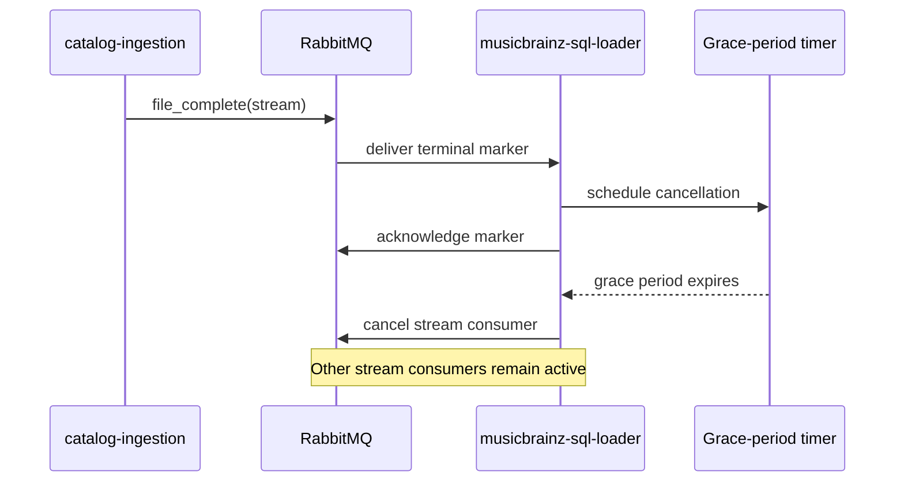

# Consumer cancellation and draining

Each MusicBrainz stream has its own RabbitMQ consumer. Cancellation releases broker
resources after a stream finishes without interrupting in-flight deliveries.

`CONSUMER_CANCEL_DELAY` controls the grace period and defaults to 300 seconds. Set it to
`0` to leave consumers subscribed. Duplicate completion markers do not schedule duplicate
cancellation tasks.

## Graceful process shutdown

Process shutdown is a separate path from file completion:

1. Stop all consumer subscriptions so no new deliveries arrive.
2. Cancel progress, queue-check, and pending cancellation tasks.
3. Close the RabbitMQ connection, which requeues any unsettled deliveries once.
4. Close the PostgreSQL pool and health server.

An incoming delivery observed after shutdown begins is deliberately left unsettled. An
immediate `nack(requeue=True)` while the subscription remains active would redeliver the
same message in a tight loop and consume the quorum queue's delivery budget.

Regression coverage for this ordering lives in
[`tests/test_shutdown_delivery_churn.py`](../tests/test_shutdown_delivery_churn.py) and
the drain tests in [`tests/test_brainztableinator.py`](../tests/test_brainztableinator.py).
