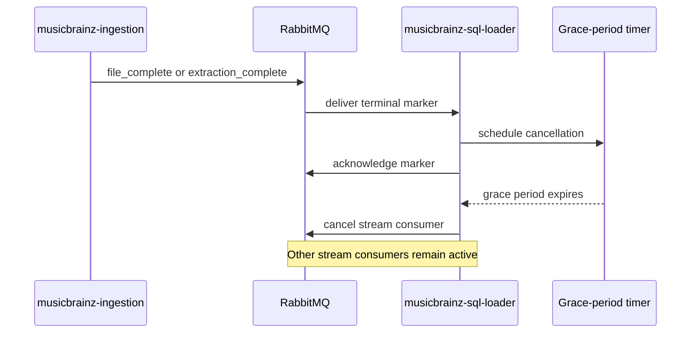

# Consumer cancellation and draining

Each MusicBrainz stream has its own RabbitMQ consumer. Cancellation releases broker
resources after a stream finishes without interrupting in-flight deliveries.

`CONSUMER_CANCEL_DELAY` controls the grace period and defaults to 300 seconds. Set it to
`0` to leave consumers subscribed. If another completion marker arrives before the timer
expires, the loader cancels the existing task and starts one new grace-period timer for that
stream.

## Graceful process shutdown

Process shutdown is a separate path from file completion:

1. Stop all consumer subscriptions so no new deliveries arrive.
2. Cancel progress, queue-check, and pending cancellation tasks.
3. Close the RabbitMQ connection, which requeues any unsettled deliveries once.
4. Close the PostgreSQL pool and health server.

A delivery that reaches the handler after shutdown begins is deliberately left unsettled; a
handler already inside its transaction may still finish normally. An immediate
`nack(requeue=True)` while a subscription remains active would redeliver the same message in
a tight loop and consume the quorum queue's delivery budget.

Regression coverage for this ordering lives in
[`tests/test_shutdown_delivery_churn.py`](../tests/test_shutdown_delivery_churn.py) and
the drain tests in [`tests/test_brainztableinator.py`](../tests/test_brainztableinator.py).
The producer's authoritative completion semantics are documented in the
[`musicbrainz-ingestion` state-marker system](https://github.com/groovemap-music/musicbrainz-ingestion/blob/main/docs/state-marker-system.md#completion-signals).
