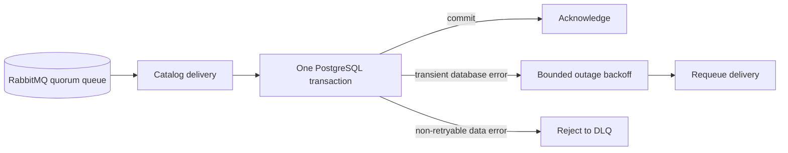

# Database resilience

`musicbrainz-sql-loader` uses the pinned `groovemap-runtime` PostgreSQL and RabbitMQ
adapters. The service is designed to pause safely during a transient database outage and
resume from durable broker state.

## PostgreSQL

The async pool defaults to 2–12 connections. Channel-global AMQP prefetch equals the
configured pool maximum, so RabbitMQ never sends more concurrent work than the pool can
service. Each catalog record uses one bounded transaction, and relationship and external
link children use `executemany` to reduce round trips.

`InterfaceError`, `OperationalError`, and `DatabaseUnavailableError` are transient. The
loader waits before requeueing so a maintenance window cannot rapidly consume the quorum
queue's finite delivery limit. Deterministic `DataError` and `IntegrityError` failures are
rejected without retry and arrive in the dead-letter queue.

## RabbitMQ and restart

The broker connection uses heartbeat monitoring and bounded reconnect attempts. Exchanges,
quorum queues, dead-letter exchanges, and dead-letter queues are durable. Graceful process
shutdown cancels subscriptions before closing the connection so unsettled records are
redelivered once rather than churned.

## Health

Port `8010` reports `starting` before the PostgreSQL pool exists, `unhealthy` for a
detected stuck state, and `healthy` once the pool is available and consumer state is
consistent. Connection strings and credentials are never returned or logged.

For capacity rationale and the prior pool-exhaustion diagnosis, see
[PostgreSQL connection-budget analysis](postgres-pool-exhaustion-analysis.md).
