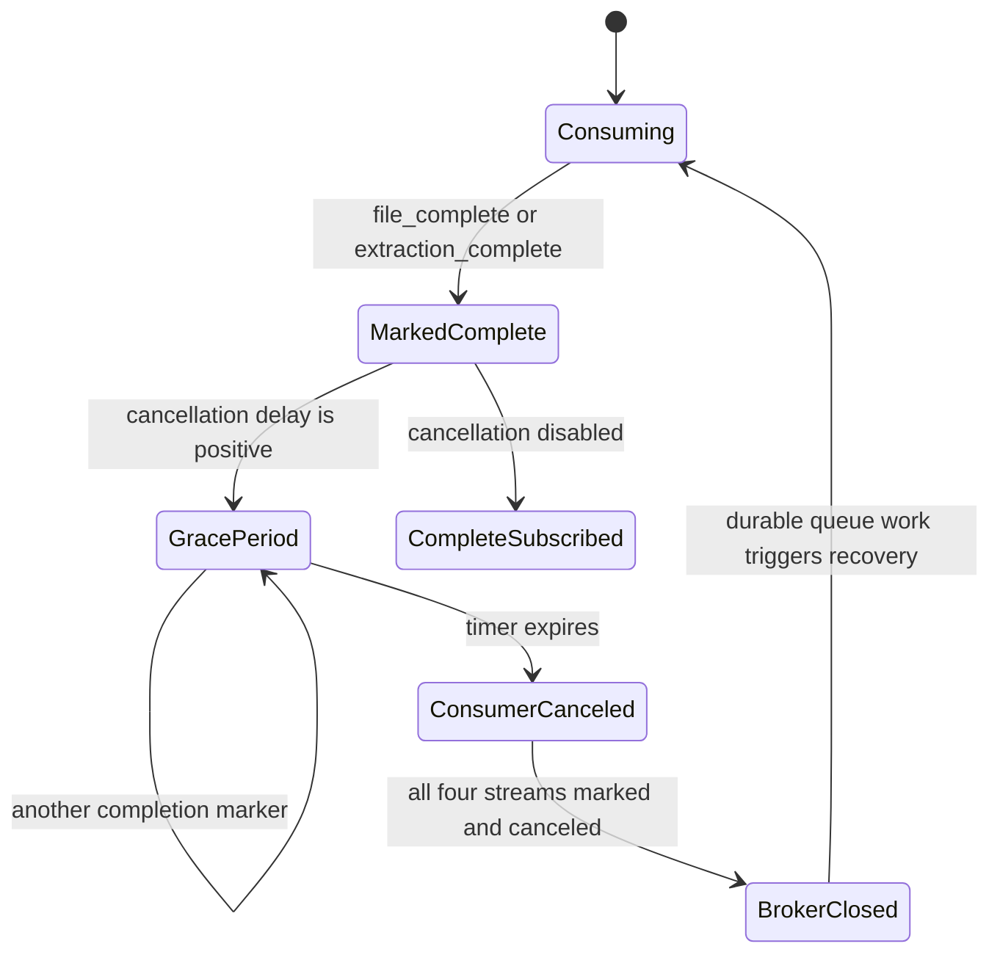

# File and extraction completion

`musicbrainz-sql-loader` recognizes two control events alongside catalog records.

## `file_complete`

The event marks one of `artists`, `labels`, `release-groups`, or `releases` complete. The
loader schedules that stream's consumer cancellation, records the stream in
`completed_files`, and acknowledges the event. A configurable grace period allows
deliveries already in flight to finish.

## `extraction_complete`

The producer publishes this version-level terminal event to every stream. Each delivery
reasserts completion for its receiving stream even when the process restarted after
acknowledging `file_complete`, preventing a false stuck state. Once all four streams are
marked complete and their consumers have canceled, the loader closes the active broker
connection and enters periodic queue-check mode.

Unlike SQL loaders that own stale-row purging, this service does not infer deletion from
a timestamp. It stores the current MusicBrainz records supplied by the producer. Schema
constraints and migrations remain owned by `database-schema`.

## Recovery and monitoring

Completion state is intentionally not persisted locally. RabbitMQ is the durable source
of pending work, and PostgreSQL upserts are idempotent. The health response exposes:

- `message_counts` for successfully acknowledged records;
- `active_consumers` for streams currently subscribed;
- `completed_files` for terminal streams;
- `current_task` and `status`, including stuck-state detection.

The test suite covers duplicate completion events, restart recovery, cancellation timing,
and shutdown delivery churn without connecting to RabbitMQ or PostgreSQL.

This page describes only consumer state. The producer's durable download/processing state
and rules for emitting both markers are owned by
[`musicbrainz-ingestion`](https://github.com/groovemap-music/musicbrainz-ingestion/blob/main/docs/state-marker-system.md).
