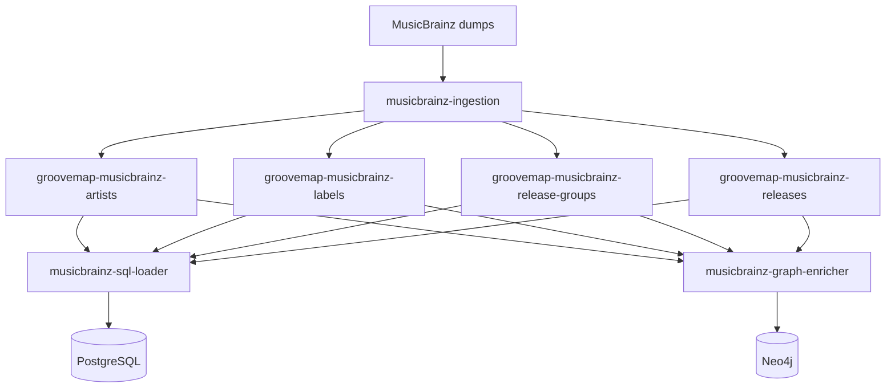

# MusicBrainz import and restart behavior

The import starts in
[`musicbrainz-ingestion`](https://github.com/groovemap-music/musicbrainz-ingestion), which
reads MusicBrainz JSONL dumps and publishes catalog events. `musicbrainz-sql-loader` is the
PostgreSQL consumer for the complete MusicBrainz dataset. `musicbrainz-graph-enricher`
consumes the same fanout exchanges for graph enrichment; neither consumer is upstream of
the other.



## Import lifecycle

1. The producer publishes records for artists, labels, release groups, and releases.
2. The loader acknowledges a record only after its PostgreSQL transaction succeeds.
3. A `file_complete` event marks its receiving stream complete and starts or replaces that
   stream's cancellation grace-period task.
4. After all four files finish, the producer publishes `extraction_complete` to all four
   exchanges. Each delivered marker reasserts completion for its receiving stream and also
   starts or replaces its cancellation timer.
5. When all four streams are marked complete and all four consumers have canceled, the
   loader closes its broker connection. The periodic queue checker later reconnects and
   restarts all stream consumers if any durable queue has work.

The producer owns event generation and restart markers; see its
[state-marker system](https://github.com/groovemap-music/musicbrainz-ingestion/blob/main/docs/state-marker-system.md)
and [catalog-event contract](https://github.com/groovemap-music/musicbrainz-ingestion/blob/main/contracts/catalog-events/README.md).

The `musicbrainz` schema and its tables are initialized by the separately released
`database-schema` image. This loader performs upserts only; it does not run migrations or
embed a competing schema definition.

| Loader-owned write path | Schema-owned table |
| --- | --- |
| Artist upsert | `musicbrainz.artists` |
| Label upsert | `musicbrainz.labels` |
| Release-group upsert | `musicbrainz.release_groups` |
| Release upsert | `musicbrainz.releases` |
| Relationship batch | `musicbrainz.relationships` |
| External-link batch | `musicbrainz.external_links` |

The authoritative table and index inventory remains in the
[`database-schema` architecture](https://github.com/groovemap-music/database-schema/blob/main/docs/architecture.md#postgresql-media-schema).

## Canonical media block

`musicbrainz.releases.media` holds the canonical media block from
[ADR 0007](https://github.com/groovemap-music/design/blob/main/docs/adr/0007-canonical-media-taxonomy.md).
The schema owner supplies its GIN family index, and `process_release` writes the column on
every upsert:

- A release event that already carries the precomputed `media` object (a producer at or
  after the media rollout) writes that block verbatim.
- A release event carrying only the raw `media_raw` medium list (a producer that predates
  the field) derives a best-effort block from it through the shared `common.media` mapper,
  along with `status`/`packaging`/`release_group` when present.
- A release with neither field still writes a schema-valid empty block, so the column is
  never NULL for a row this loader writes.

The raw medium list (`media_raw`, when the event carries it) is untouched and stored as
received inside the `data` column, alongside every other raw field.

## Restart guarantees

The loader first cancels its subscriptions and then closes the broker connection. A
delivery that reaches the handler after the shutdown flag is set remains unsettled so
RabbitMQ can redeliver it once when the service restarts; a handler already inside its
transaction may still finish normally. Idempotent upserts make redelivery safe.

Completion and active-consumer sets are process memory. On process start they begin empty;
the loader declares the same durable exchanges, quorum queues, classic dead-letter queues,
and all four consumers. Periodic recovery is the later idle/stuck-state path. Durable queue
names intentionally retain the `brainztableinator` consumer suffix for compatibility:
`groovemap-musicbrainz-brainztableinator-{entity}`, with `.dlx` and `.dlq` suffixes for
dead-letter routing.

## Observe an import

The
[`deployment`](https://github.com/groovemap-music/deployment/blob/main/docs/quick-start.md)
repository exposes the loader health endpoint on port `8010`:

```bash
curl --fail http://localhost:8010/health
```

Use `message_counts`, `active_consumers`, `completed_files`, and `current_task` in the
response to distinguish active, draining, idle, and stuck states. The deployment
repository owns the exact Compose commands and service wiring.
