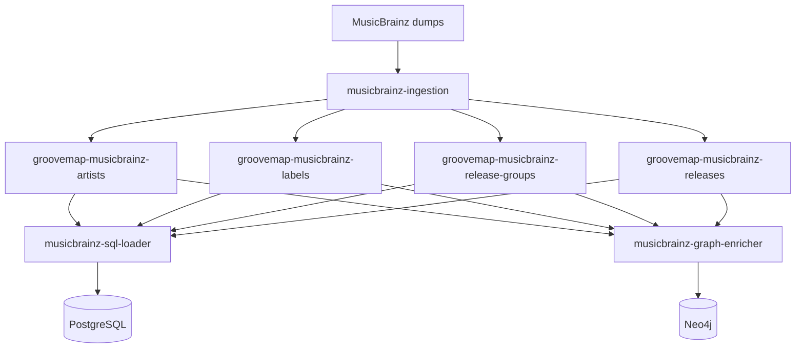

# MusicBrainz import and restart behavior

The import starts in
[`musicbrainz-ingestion`](https://github.com/groovemap-music/musicbrainz-ingestion), which
reads MusicBrainz JSONL dumps and publishes catalog events. `musicbrainz-sql-loader` is the
PostgreSQL consumer for the complete MusicBrainz dataset. `musicbrainz-graph-enricher`
consumes the same fanout exchanges for graph enrichment; neither consumer is upstream of
the other.



## Import lifecycle

1. The producer publishes records for artists, labels, release groups, and releases.
2. The loader acknowledges a record only after its PostgreSQL transaction succeeds.
3. A `file_complete` event marks its receiving stream complete and starts or replaces that
   stream's cancellation grace-period task.
4. After all four files finish, the producer publishes `extraction_complete` to all four
   exchanges. Each delivered marker reasserts completion for its receiving stream and also
   starts or replaces its cancellation timer.
5. When all four streams are marked complete and all four consumers have canceled, the
   loader closes its broker connection. The periodic queue checker later reconnects and
   restarts all stream consumers if any durable queue has work.

The producer owns event generation and restart markers; see its
[state-marker system](https://github.com/groovemap-music/musicbrainz-ingestion/blob/main/docs/state-marker-system.md)
and [catalog-event contract](https://github.com/groovemap-music/musicbrainz-ingestion/blob/main/contracts/catalog-events/README.md).

The `musicbrainz` schema and its tables are initialized by the separately released
`database-schema` image. This loader performs upserts only; it does not run migrations or
embed a competing schema definition.

| Loader-owned write path | Schema-owned table |
| --- | --- |
| Artist upsert | `musicbrainz.artists` |
| Label upsert | `musicbrainz.labels` |
| Release-group upsert | `musicbrainz.release_groups` |
| Release upsert | `musicbrainz.releases` |
| Relationship batch | `musicbrainz.relationships` |
| External-link batch | `musicbrainz.external_links` |

The authoritative table and index inventory remains in the
[`database-schema` architecture](https://github.com/groovemap-music/database-schema/blob/main/docs/architecture.md#postgresql-media-schema).

## Native catalog identity

Every row this loader writes carries `gm_item_id`, the native catalog identifier from
[ADR 0009](https://github.com/groovemap-music/design/blob/main/docs/adr/0009-native-catalog-identity.md).
A provider's own identifier is evidence, not identity: `provider_aliases` maps a
`(provider, entity_kind, external_id)` triple onto one GrooveMap-minted UUID, and the four
upserts write the id that mapping yields.

The entity kind is the vocabulary's, not the provider's spelling. An artist is `artist`, a
label is `label`, a release is `release`, and a **release group is `master`** — both names
describe the abstract work a release is an edition of.

Each `process_*` method resolves the id on the message's own connection, inside the message's
transaction, before it calls the writer:

- **Attach.** When the record carries the matching Discogs identifier
  (`discogs_artist_id`, `discogs_label_id`, `discogs_release_id`, or `discogs_master_id`) and
  a Discogs alias already resolves, the MusicBrainz alias is attached to *that* item's native
  id. The row shares the identifier the Discogs loader already minted instead of opening a
  parallel item for the same record. The existing alias always wins, so an attach that races
  another writer returns the id the winning alias names and nothing is ever overwritten.
- **Mint.** A record with no Discogs identifier, or one whose Discogs identifier no alias has
  claimed yet, resolves its own MusicBrainz alias, which mints a catalog item on a miss.

Resolution costs one to three short queries per message on the connection the upsert already
holds, so a failure rolls the alias back with the row it was minted for.

Ordering is not guaranteed between the two loaders. A MusicBrainz record that names a Discogs
release the Discogs loader has not yet ingested mints its own item, and the pair is then two
items for one record. Repairing those pairs is a **follow-on reconciliation job** that walks
the `discogs_*` columns after both catalogs have loaded and merges the duplicates; it is
deliberately not this loader's work, because blocking a message on a counterpart that may
never arrive would stall the import.

A row whose alias could not be resolved is still written, with `gm_item_id` left NULL for that
same job to fill. Identity is additive here: it never dead-letters a record.

## Catalogue identifier aliases

A release also publishes identifiers that are not MusicBrainz's own: the printed `barcode`,
and the catalogue numbers inside `catalog_numbers`, each an entry of the release's label
information. Both are alias namespaces the
[ADR 0009](https://github.com/groovemap-music/design/blob/main/docs/adr/0009-native-catalog-identity.md)
provider vocabulary reserves, and
[ADR 0011](https://github.com/groovemap-music/design/blob/main/docs/adr/0011-catalog-identifiers-and-manufacturing-credits.md)
decides what fills them. `process_release` attaches both to the release's native id, right
after the row itself is written and on the same connection inside the same transaction.

The point is cross-catalog lookup: a barcode learned here and the same barcode learned from
Discogs must name one item, not two. That only holds if both sides compare the value the same
way, so the loader does not normalize anything itself. It builds the identifiers block ADR 0011
publishes and hands it to `common.identifiers.alias_refs_for_release` in the shared runtime,
which is the single implementation of the comparison: a barcode compares as its ASCII digits,
so printed grouping spaces and hyphens do not change identity, and a catalogue number compares
trimmed, whitespace-collapsed, and upper-cased, which is how one label prints the same number
two ways. Two values that normalize alike are one alias. A value that normalizes away to
nothing mints none.

- **Absent fields attach nothing.** A release with no barcode and no catalogue numbers, and a
  legacy event published before the producer carried either field, run no alias statement at
  all. Neither is an error.
- **A conflict is counted, not raised.** `attach_aliases` never overwrites, so a barcode
  another catalog has already claimed comes back naming *that* item. The two catalogs disagree
  about which release a printed number belongs to; the loader counts the conflict in its log
  line, keeps the id the release's own alias resolved, and lets the message succeed. Resolving
  the disagreement is the same reconciliation job's work as the duplicate pairs above.

The release's `country` and `release_events` fields need no such handling. They are carried
verbatim inside the `data` column the upsert already writes, and the schema adds no column for
either.

## Canonical media block

`musicbrainz.releases.media` holds the canonical media block from
[ADR 0007](https://github.com/groovemap-music/design/blob/main/docs/adr/0007-canonical-media-taxonomy.md).
The schema owner supplies its GIN family index, and `process_release` writes the column on
every upsert:

- A release event that already carries the precomputed `media` object (a producer at or
  after the media rollout) writes that block verbatim.
- A release event carrying only the raw `media_raw` medium list (a producer that predates
  the field) derives a best-effort block from it through the shared `common.media` mapper,
  along with `status`/`packaging`/`release_group` when present.
- A release with neither field still writes a schema-valid empty block, so the column is
  never NULL for a row this loader writes.

The raw medium list (`media_raw`, when the event carries it) is untouched and stored as
received inside the `data` column, alongside every other raw field.

## Restart guarantees

The loader first cancels its subscriptions and then closes the broker connection. A
delivery that reaches the handler after the shutdown flag is set remains unsettled so
RabbitMQ can redeliver it once when the service restarts; a handler already inside its
transaction may still finish normally. Idempotent upserts make redelivery safe.

Completion and active-consumer sets are process memory. On process start they begin empty;
the loader declares the same durable exchanges, quorum queues, classic dead-letter queues,
and all four consumers. Periodic recovery is the later idle/stuck-state path. Durable queue
names intentionally retain the `brainztableinator` consumer suffix for compatibility:
`groovemap-musicbrainz-brainztableinator-{entity}`, with `.dlx` and `.dlq` suffixes for
dead-letter routing.

## Observe an import

The
[`deployment`](https://github.com/groovemap-music/deployment/blob/main/docs/quick-start.md)
repository exposes the loader health endpoint on port `8010`:

```bash
curl --fail http://localhost:8010/health
```

Use `message_counts`, `active_consumers`, `completed_files`, and `current_task` in the
response to distinguish active, draining, idle, and stuck states. The deployment
repository owns the exact Compose commands and service wiring.
