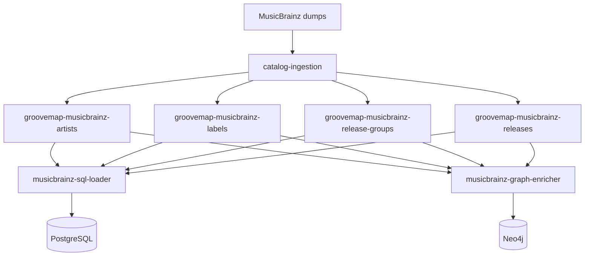

# MusicBrainz import and restart behavior

The import starts in `catalog-ingestion`, which reads MusicBrainz JSONL dumps and
publishes catalog events. `musicbrainz-sql-loader` is the PostgreSQL consumer for the
complete MusicBrainz dataset. `musicbrainz-graph-enricher` consumes the same fanout
exchanges for graph enrichment; neither consumer is upstream of the other.



## Import lifecycle

1. The producer publishes records for artists, labels, release groups, and releases.
2. The loader acknowledges a record only after its PostgreSQL transaction succeeds.
3. A `file_complete` event marks one stream complete and starts its cancellation grace
   period.
4. An `extraction_complete` event is the terminal signal for each stream.
5. After all streams complete, the loader becomes idle and periodically checks the
   durable queues for new work.

The `musicbrainz` schema and its tables are initialized by the separately released
`database-schema` image. This loader performs upserts only; it does not run migrations or
embed a competing schema definition.

## Canonical media block

`musicbrainz.releases.media` holds the canonical media block from ADR 0007 (see the
`design` repository), indexed with a GIN index on `media -> 'families'` for medium-level
queries. `process_release` writes it on every upsert:

- A release event that already carries the precomputed `media` object (a producer at or
  after the media rollout) writes that block verbatim.
- A release event carrying only the raw `media_raw` medium list (a producer that predates
  the field) derives a best-effort block from it through the shared `common.media` mapper,
  along with `status`/`packaging`/`release_group` when present.
- A release with neither field still writes a schema-valid empty block, so the column is
  never NULL for a row this loader writes.

The raw medium list (`media_raw`, when the event carries it) is untouched and stored as
received inside the `data` column, alongside every other raw field.

## Restart guarantees

Normal records that are being processed during shutdown remain unacknowledged. The
loader first cancels its subscriptions and then closes the broker connection, allowing
RabbitMQ to redeliver each unsettled record once when the service restarts. Idempotent
upserts make that redelivery safe.

Completion and active-consumer sets are process memory. On restart they begin empty, the
loader declares the same durable queues, and the periodic recovery check restarts
consumers for queued work. Durable queue names intentionally retain the
`brainztableinator` consumer suffix for compatibility.

## Observe an import

The deployment repository exposes the loader health endpoint on port `8010`:

```bash
curl --fail http://localhost:8010/health
```

Use `message_counts`, `active_consumers`, `completed_files`, and `current_task` in the
response to distinguish active, draining, idle, and stuck states. The deployment
repository owns the exact Compose commands and service wiring.
