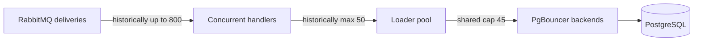

# PostgreSQL connection-budget analysis

## Incident

During a MusicBrainz bulk import, the SQL loader repeatedly exhausted its client pool
while PgBouncer's 45-connection per-database backend cap was full. The deployment was not
leaking connections: it had configured more simultaneous client demand than the shared
backend could provide.

## Root cause

The historical loader configuration allowed 50 PostgreSQL connections while delivering
up to 200 messages to each of four consumers. One service could therefore request more
connections than the entire PgBouncer backend budget, and hundreds of handlers could wait
for that oversized pool at once.

Each message correctly owned one transaction, but relationship and external-link rows
were inserted one at a time. Those network round trips extended the transaction and held
the session-pooled backend longer than necessary.

## Implemented corrections

- The loader's default pool is 2–12 connections and can be clamped with
  `POSTGRES_POOL_MIN_SIZE` and `POSTGRES_POOL_MAX_SIZE`.
- RabbitMQ channel-global prefetch equals the loader's pool maximum. The broker now
  applies backpressure before handlers contend for unavailable connections.
- Relationship and external-link child rows use `executemany`, reducing each message's
  database round trips to the entity upsert plus two batched child operations.
- Transient acquisition failures retain bounded retry and outage backoff; deterministic
  data errors are not retried.

With the reviewed fleet defaults, the expected maxima are:

| Service | Default maximum PostgreSQL connections |
| --- | ---: |
| `catalog-api` | 8 |
| `discogs-sql-loader` | 12 |
| `musicbrainz-sql-loader` | 12 |
| analytics service | 4 |
| single-connection console path | approximately 1 |

The combined default remains below 45 and leaves room for health-check transients.
Deployment-specific values remain the deployment repository's responsibility.

## Operational rule

Raise a service pool only when measured throughput requires it, and change the PgBouncer
budget and the sum of every service maximum together. A single service maximum must never
exceed the shared backend cap. For the loader's configurable values, see the
[configuration reference](configuration.md).
